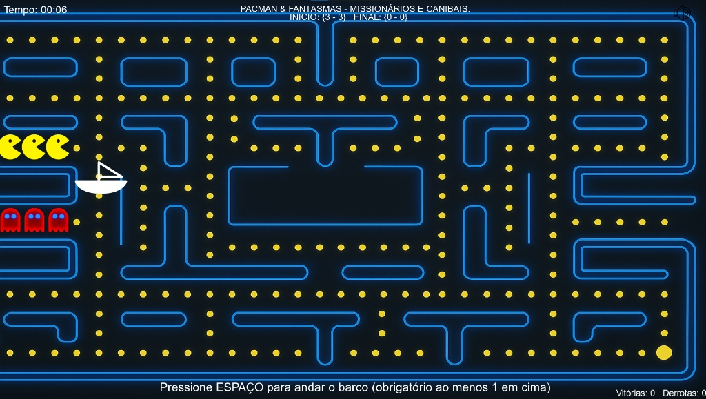

#  Pac-Man & Fantasmas: Missionários e Canibais

> Uma releitura visual e interativa do clássico problema lógico-matemático de travessia, desenvolvido e apresentado na **Feira de Matemática**.

 

---

##  A Lógica Matemática por Trás

Este jogo é uma adaptação do famoso enigma dos **Missionários e Canibais**, muito utilizado no estudo de **Estrutura de Dados**, **Teoria dos Grafos** e **Inteligência Artificial (Algoritmos de Busca em Espaço de Estados)**.

### O Desafio:
Você começa com **3 Pac-mans** (Missionários) e **3 Fantasmas** (Canibais) na margem esquerda do mapa. Seu objetivo é transportá-los em segurança para a margem direita usando um barco.

### As Regras de Ouro:
1. **Capacidade do Barco:** O barco transporta no máximo **2 personagens** e precisa de pelo menos **1** a bordo para navegar.
2. **A Regra de Ouro (Invasão de Fantasmas):** Em nenhuma das margens o número de Fantasmas (Vermelhos) pode ser maior do que o número de Pac-mans (Amarelos). Se em algum momento um lado ficar com mais Fantasmas do que Pac-mans, os fantasmas devoram os Pac-mans e é **Game Over**! 
*(Nota: Se um lado tiver zero Pac-mans, os Fantasmas podem ficar lá sozinhos sem problemas).*

---

##  Como Jogar (Sem Instalar Nada!)

Para facilitar a jogabilidade de quem não é desenvolvedor e não tem o Python instalado, o jogo foi compilado em um executável direto.

1. Baixe a pasta do jogo.
2. Dê dois cliques no arquivo **`Pacman & Fantasmas - Missionários & Canibais - Corrigido.exe`** (ou o nome do seu executável).
3. **Controles:**
   * Use o mouse para colocar os personagens dentro do barco.
   * Pressione a tecla **`ESPAÇO`** para mover o barco de uma margem para a outra.
   * Pressione a tecla **`ESC`** para fechar o aplicativo a qualquer momento.
   * Tente resolver o enigma no menor tempo possível e sem perder nenhum Pac-man!

---

##  Tecnologias Utilizadas

* **Python** (Linguagem base)
* **Pygame** (Biblioteca para renderização dos gráficos e física do jogo)
* **Pyinstaller** (Usado para empacotar o código Python e os assets em um arquivo `.exe` standalone)

---

##  Precisa de um projeto de lógica, jogo educativo ou automação?

Eu desenvolvo **ferramentas web, jogos educativos de matemática, calculadoras e sistemas sob medida** para o seu projeto acadêmico, empresa ou comunidade de jogos.

Entre em contato e vamos estruturar sua ideia:
* **Discord:** [Sem no momento]
* **E-mail:** [athaydes.marcos@gmail.com]
